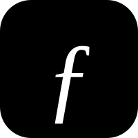

<div align="center">
  
  <h1>Folio</h1>
  <p>A minimalist, zero-dependency self-hosted publishing platform inspired by <strong><a href="https://telegra.ph">Telegra.ph</a></strong>.</p>

  [](https://folio.arinahub.com)
  [](https://folio.arinahub.com/privacy)
  [](https://folio.arinahub.com/terms)

  [](https://github.com/adsurkasur/folio/blob/master/go.mod)
  [](https://github.com/adsurkasur/folio/blob/master/LICENSE)
  [](https://github.com/adsurkasur/folio/commits/master)
</div>

<br>

Folio distills web publishing to its core essentials: **Title**, **Author**, and **Story**. Designed for simplicity, it eliminates the need for user accounts, external database servers, and complex configuration. 

Delivered as a single, portable Go binary, Folio is lightweight, standalone, and ready to run immediately.

## Key Features

- **No Accounts Required**: Instant anonymous publishing. Ownership and editing rights are securely managed via browser cookies and backup tokens.
- **Pure Keyboard Markdown**: Fast inline formatting for headings (`#`, `##`, `###`), quotes (`>`), dividers (`---`), bullet and numbered lists, inline code (`code`), and code blocks (```).
- **Media & Embeds**: Upload local images or embed external links directly into the canvas.
- **Automated Social Previews**: The server automatically resizes and compresses lead images to ensure Open Graph preview compatibility (< 300KB) across messaging platforms (WhatsApp, Telegram, Discord, X).
- **Single Portable Binary**: Built entirely in Go with a pure-Go SQLite driver (`modernc.org/sqlite`). Templates and static HTML/CSS/JS assets are fully embedded (`//go:embed`). No external web server or database setup is required.
- **Spam Control & Storage Cleanup**: Built-in IP rate limiting and an automated background worker that purges unreferenced draft media.
- **Local Draft Recovery**: Work in progress is automatically preserved in the browser's local storage to prevent accidental data loss.

---

## Quickstart: Download & Run

Folio is distributed as a single executable. There is no need to install runtime dependencies such as Go, PHP, Apache, or MySQL.

1. Navigate to the [Releases page](../../releases/latest) and download the appropriate file for your operating system (Windows `.exe`, Linux, or macOS).
2. Place the executable in an empty directory on your computer or server.
3. Run the executable (double-click on Windows, or execute via terminal).
4. Open your web browser and navigate to `http://localhost:8085`.

**Data Storage**
Folio is designed to be fully portable. Upon execution, it automatically generates a SQLite database (`folio.db`) and an `uploads/` directory in the exact same location as the binary. All articles and uploaded media are stored locally within this directory. To back up or migrate your installation, simply copy the entire directory.

---

## Build from Source

If you prefer to compile Folio yourself or wish to modify the source code, you can build it locally.

### Prerequisites
- Go 1.22 or higher

### Build Instructions
```bash
# Clone the repository
git clone https://github.com/adsurkasur/folio.git
cd folio

# Build the binary
go build -o folio main.go

# Run the server
./folio -port 8085
```

## License

Licensed under the [Apache License 2.0](LICENSE).
